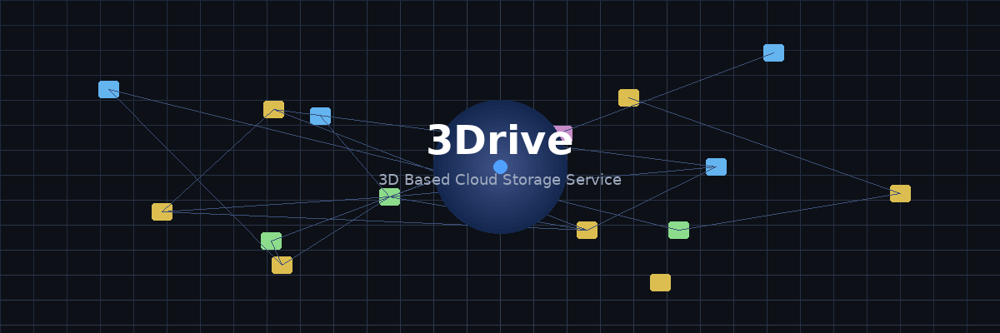
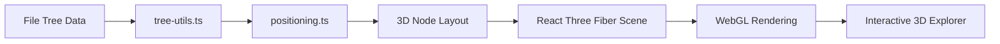

<p align="center">
  
</p>

<h1 align="center">3Drive</h1>
<h3 align="center">3D Based Cloud Storage Service</h3>

<p align="center">
  Experience your file system in 3D space — browse, manage, and interact with files in an immersive environment.
</p>

<p align="center">
  
  
  
  
  
  
  
</p>

<p align="center">
  <a href="#-demo">Demo</a> •
  <a href="#-key-features">Features</a> •
  <a href="#%EF%B8%8F-architecture">Architecture</a> •
  <a href="#-getting-started">Getting Started</a> •
  <a href="#-tech-stack">Tech Stack</a>
</p>

---

## 🎬 Demo

<table>
  <tr>
    <td align="center" width="50%">
      
      <br />
      <sub><b>3D File Explorer</b> — Navigate your files in an interactive 3D space</sub>
    </td>
    <td align="center" width="50%">
      
      <br />
      <sub><b>Landing Page</b> — Clean, immersive onboarding experience</sub>
    </td>
  </tr>
</table>

> 💡 **Note:** This is a portfolio/demo version running on mock data. It does not connect to a real backend server.

---

## ✨ Key Features

<table>
  <tr>
    <td align="center" width="20%">🗂️<br /><b>3D File Explorer</b></td>
    <td align="center" width="20%">🎯<br /><b>Drag & Drop</b></td>
    <td align="center" width="20%">🧭<br /><b>Folder Navigation</b></td>
    <td align="center" width="20%">🖼️<br /><b>File Preview</b></td>
    <td align="center" width="20%">🎥<br /><b>Camera Controls</b></td>
  </tr>
  <tr>
    <td align="center"><sub>Browse files and folders rendered as interactive 3D nodes</sub></td>
    <td align="center"><sub>Move files between folders with intuitive drag-and-drop</sub></td>
    <td align="center"><sub>Traverse hierarchical folder structures seamlessly</sub></td>
    <td align="center"><sub>Preview file metadata and contents on click</sub></td>
    <td align="center"><sub>Zoom, pan, and rotate the 3D camera freely</sub></td>
  </tr>
</table>

---

## 🏗️ Architecture

```
3Drive/
├── app/                    # Next.js App Router
│   ├── api/                # API routes
│   ├── login/              # Login page
│   ├── signup/             # Signup page
│   ├── example/            # Demo/example page
│   ├── layout.tsx          # Root layout
│   └── page.tsx            # Landing page
├── ui/                     # UI layer
│   ├── Components/
│   │   ├── 3d-components/  # Three.js 3D components
│   │   ├── context/        # React Context providers
│   │   ├── hooks/          # Custom React hooks
│   │   ├── finder.tsx      # File finder component
│   │   ├── global-nav.tsx  # Global navigation
│   │   ├── side-nav.tsx    # Side navigation panel
│   │   └── onboarding.tsx  # Onboarding flow
│   ├── MainPage/           # Main 3D page views
│   ├── LoginPage/          # Login UI
│   └── Modal/              # Modal dialogs
├── lib/                    # Core utilities
│   ├── file-model.tsx      # File 3D model
│   ├── folder-model.tsx    # Folder 3D model
│   ├── root-model.tsx      # Root node model
│   ├── logo-model.tsx      # Logo 3D model
│   ├── positioning.ts      # Node positioning logic
│   ├── tree-utils.ts       # File tree utilities
│   ├── sample-tree.ts      # Mock data tree
│   └── angles.ts           # Angle calculations
├── backend/                # Backend logic
│   └── account-actions.ts  # Auth actions
├── types/                  # TypeScript type definitions
└── public/                 # Static assets (models, textures)
```

<p align="center">
  <b>Rendering Pipeline</b>
</p>



---

## 🚀 Getting Started

**Prerequisites:** Node.js 18+ and npm

```bash
# 1. Clone the repository
git clone https://github.com/your-id/3Drive.git
cd 3Drive

# 2. Install dependencies
npm install

# 3. Start the development server
npm run dev

# 4. Open in browser
open http://localhost:3000
```

---

## 🛠 Tech Stack

| Category          | Technologies                                                  |
| ----------------- | ------------------------------------------------------------- |
| **Framework**     | Next.js 15, React 19                                          |
| **3D Rendering**  | Three.js, React Three Fiber, React Three Drei, Postprocessing |
| **Animation**     | Framer Motion, GSAP                                           |
| **Styling**       | Tailwind CSS 4                                                |
| **Auth**          | NextAuth.js, bcryptjs, JWT                                    |
| **UI Components** | Radix UI, SweetAlert2, React Hot Toast                        |
| **Language**      | TypeScript 5                                                  |
